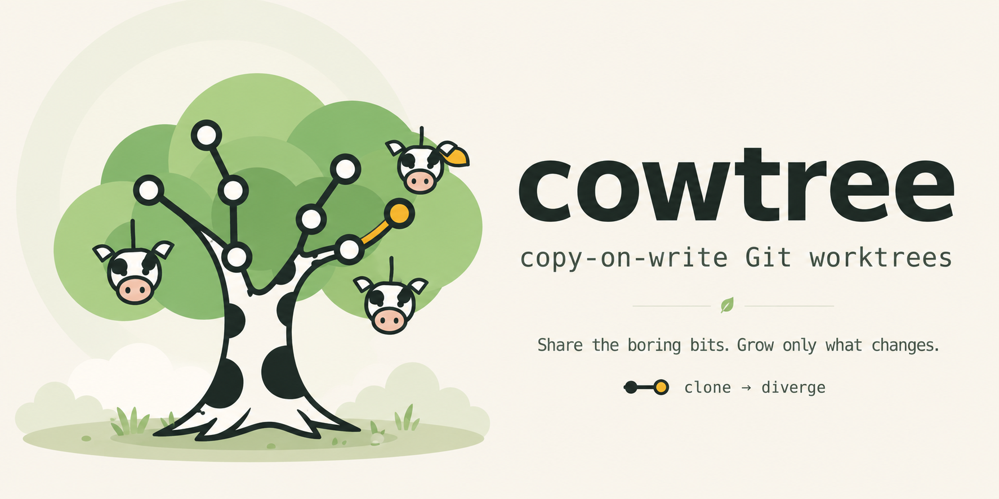

<p align="center">
  
</p>

<p align="center">
  Copy-on-write Git worktrees for Claude Code and Codex.
</p>

`cowtree` creates a new worktree with Git's `--no-checkout` setup, reflinks
unchanged tracked files from a clean existing worktree, refreshes the index,
and lets Git materialize everything that cannot be safely shared. Unsupported
filesystems, cross-device paths, dirty sources, and partial failures fall back
to a normal checkout.

The implementation is a portable Python helper with no third-party runtime
dependencies. Linux uses native `FICLONE` when available and falls back to
`cp --reflink=always`; macOS uses APFS clone support.

## Use

Put the repository's `bin` directory on `PATH` to enable Git's subcommand
dispatch:

```sh
export PATH="/path/to/cowtree/bin:$PATH"
```

Then use the familiar `git worktree add` shape:

```sh
git cowtree add ../repo-feature feature
git cowtree add -b topic ../repo-topic main
git cowtree add -v --from ../repo-main ../repo-topic topic
```

The underlying helper can also be run directly:

```sh
python3 scripts/cow_worktree.py add --verbose \
  --from /path/to/clean-source /path/to/new-worktree <commit-ish>
```

The skill instructions are in [`SKILL.md`](SKILL.md). Install the repository
as a user-scoped skill by cloning it into `~/.agents/skills/cowtree`,
then link that directory into the Claude and Codex skill paths if needed.

## Inspiration

The copy-on-write worktree idea was inspired by [`git-cow-worktree`](https://github.com/josharian/git-cow-worktree),
created by [Josh Bleecher Snyder (`@josharian`)](https://github.com/josharian).
`cowtree` is an independent Python implementation for Claude Code and Codex;
it does not use code from that project.

## Test

```sh
bash tests/test_cow_worktree.sh
```
